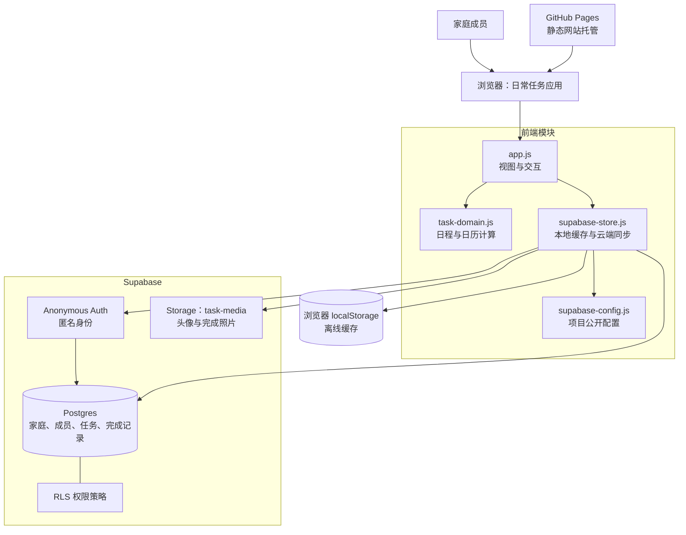

# 日常：家庭任务管理

一个无构建步骤的响应式任务管理前端。可添加/删除单次、每日、每周任务，按成员、类型、状态、日期范围筛选，并在月历中查看每天的完成进度。

## 系统架构



## 本地运行

在项目目录执行：

```bash
python3 -m http.server 4173
```

然后在浏览器打开 `http://localhost:4173`。应用会创建一个匿名会话，数据同步保存到 Supabase；不要直接以 `file://` 打开页面。

## Supabase 上线准备

1. 在 **Authentication → Providers** 启用 **Anonymous Sign-Ins**。
2. 在 SQL Editor 执行 [schema.sql](supabase/schema.sql)。它会建立任务数据表、RLS 权限和 `task-media` 图片桶。
3. 项目地址与 Publishable key 已写入 `src/supabase-config.js`；它们属于前端公开配置，切勿在仓库中放入 `service_role` 密钥。
4. 本地开发时用 HTTP 服务启动；部署到 GitHub Pages 后会自动使用线上地址。

免费项目适合个人家庭使用；连续闲置时可能会暂停，恢复后继续可用。

## 测试

```bash
node --test
node --check src/task-domain.js && node --check src/task-store.js && node --check src/supabase-store.js && node --check src/app.js
```
