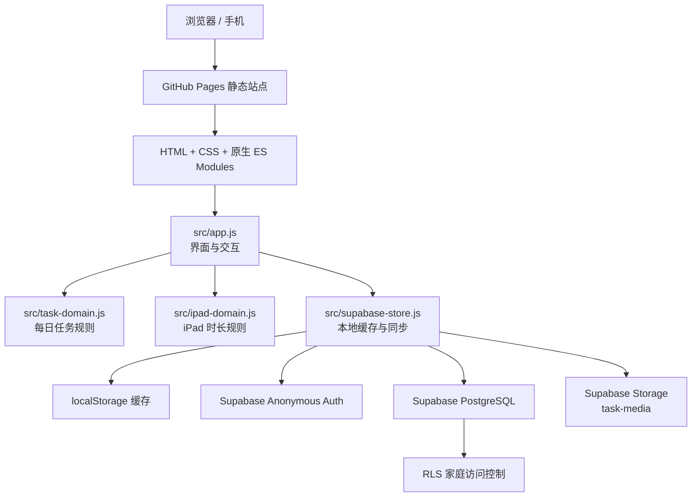

# 习惯养成

一个面向家庭的轻量习惯养成工具，包含「每日打卡」和「iPad 使用管理」两套独立但共享家庭成员与云端同步能力的功能。

线上地址：[https://antty.github.io/daily-task/](https://antty.github.io/daily-task/)

## 目录

- [产品能力](#产品能力)
- [每日打卡](#每日打卡)
- [iPad 使用管理](#ipad-使用管理)
- [技术架构](#技术架构)
- [数据与同步](#数据与同步)
- [Supabase 初始化与迁移](#supabase-初始化与迁移)
- [本地开发、测试与发布](#本地开发测试与发布)
- [代码结构](#代码结构)

## 产品能力

| 模块 | 能力概览 |
| --- | --- |
| 家庭与成员 | 选择当前成员进入系统；添加、编辑、删除成员；支持自定义头像；邀请码加入已有家庭；成员管理受密码保护。 |
| 每日打卡 | 为当前成员创建单次、每日或每周任务；日历展示任务与完成状态；完成记录可附文字与图片。 |
| 任务管理 | 编辑或删除已有任务；删除时可选择仅删除后续任务或删除全部；自定义任务类型。 |
| iPad 使用管理 | 设置当天总额度、记录多条使用时段、按类型计入或排除额度、实时计时、超时预警与月历统计。 |
| 云端同步 | 使用 Supabase 保存家庭、成员、任务、完成记录及 iPad 使用数据；图片存入 Storage。 |

## 产品关键页截图


## 每日打卡

### 使用流程

1. 首次进入选择家庭成员；首页只展示当前成员的日历与当天任务。
2. 通过任务管理新增任务。任务归属固定为当前成员，不能替其他成员创建。
3. 设置标题、可选描述、任务类型、开始日期和重复规则：仅当天、每天、每周；每周任务可选择具体星期。
4. 在首页点击任务内容查看详情；仅点击圆形勾选框可标记完成或撤销完成。
5. 标记完成时可添加可选备注和完成图片；详情页会展示这些完成凭证。

### 日历状态

- 无任务：普通日期样式。
- 未来日期有任务：只显示“有任务”标记，不判定完成或未完成。
- 当天或历史日期全部完成：绿色勾选。
- 当天或历史日期未全部完成：错误标记。
- 有任务但尚未开始：不显示完成状态。

### 管理与权限

- 家人管理仅位于首次选择成员的弹窗中，进入前需要默认密码 `123456`。
- 任务类型可在任务管理中维护。
- 家庭邀请码用于新设备加入同一家庭；已加入的设备不再显示“加入家庭”入口。
- 首页可在成员数量大于 1 时切换日历视图；切换不会改变任务归属。

## iPad 使用管理

### 设计目标

将一天的可用 iPad 时间视为一个“父额度”，每一次使用视为子记录。这样既能保留完整使用时间线，也能准确区分哪些使用类型消耗额度。

### 使用流程

1. 从首页 iPad 图标进入独立页面。页面以新标签打开，不影响每日打卡页面。
2. 必须先创建当天父额度，提供 60、120、180 分钟和自定义分钟数。
3. 添加使用记录时，必须选择使用类型；使用内容可留空。记录创建瞬间就是开始时间。
4. 同一天可创建多条子记录。若已经超额，新增“计入额度”的记录前会提示，但仍允许继续创建。
5. 点击“完成使用”时填写可选备注；完成瞬间即结束时间，系统计算本次使用时长。

### 使用类型与额度规则

- 每个使用类型都有“计入每日额度”开关。
- 计入额度：已完成记录的时长会累加到当天额度中。
- 不计额度：保留时间记录，但不参与剩余时间和超时计算；列表会显示灰色“不计额度”标签。
- 使用类型可新增、删除；进入使用类型管理需输入家庭管理密码（默认 `123456`）。

### 实时计时与超时反馈

- 进行中的记录以秒为单位局部刷新；超过 60 秒显示为“X 分钟 Y 秒”。
- 开始、结束时间固定显示在计时器上方，计时器本身使用固定宽度，避免刷新造成排版抖动。
- 进行中满 45 分钟：计时器显示黄色提醒；满 1 小时：显示红色警示。
- 已完成记录展示本次分钟数；若该条计入额度且累计时长越过当天额度，该时长显示红色警示。
- 日历中，有额度且未超时显示绿色状态；超时显示错误状态；未创建额度的日期保持普通状态。

### iPad 数据模型

| 实体 | 用途 | 关键字段 |
| --- | --- | --- |
| `ipad_usage_types` | 当前成员的使用类型 | `name`、`counts_toward_limit` |
| `ipad_daily_limits` | 成员每日父额度 | `usage_date`、`limit_minutes` |
| `ipad_usage_entries` | 每次使用子记录 | `daily_limit_id`、`type_id`、`started_at`、`ended_at`、`title`、`note` |

额度计算仅统计“已结束且类型计入额度”的记录：

```text
已用时长 = Σ（已完成且 counts_toward_limit = true 的使用记录时长）
剩余时长 = max(0, 当日额度 - 已用时长)
超时时长 = max(0, 已用时长 - 当日额度)
```

## 技术架构



- 前端采用原生 HTML、CSS、JavaScript ES Modules，无构建步骤和框架依赖。
- `localStorage` 负责断网或首次加载时的本地缓存；连接云端后由 Supabase 数据覆盖并继续同步。
- Supabase Anonymous Auth 为每台设备生成身份；邀请码 RPC 为该身份授予家庭访问权限。
- 所有家庭相关表都通过 RLS 和 `can_access_household` 限制访问范围。
- GitHub Pages 负责静态托管；推送 `main` 后由 Actions 发布。

## 数据与同步

### 每日打卡表

| 表 | 说明 |
| --- | --- |
| `households` | 家庭及邀请码 |
| `household_access` | 已加入家庭的设备身份 |
| `household_members` | 成员昵称、颜色、头像 |
| `task_types` | 每日任务类型 |
| `tasks` | 任务及重复规则 |
| `task_completions` | 单个日期的完成状态、备注与图片 |

### 图片

- 成员头像与每日任务完成图片上传至 Supabase Storage 的 `task-media` 桶。
- iPad 使用记录当前只支持文字备注，不上传图片。
- 前端只使用 Project URL 和 Publishable key；绝不能把 `service_role` 密钥写入仓库或浏览器。

## Supabase 初始化与迁移

在 Supabase **Authentication → Providers** 中启用 **Anonymous Sign-Ins**，然后在 **SQL Editor** 按以下顺序执行。

| 场景 | 需要执行的 SQL |
| --- | --- |
| 全新 Supabase 项目 | [schema.sql](supabase/schema.sql) |
| 已有旧版日常任务表，需要邀请码能力 | [invite-migration.sql](supabase/invite-migration.sql) |
| 启用 iPad 使用管理或更新 iPad 备注/自定义额度能力 | [ipad-usage-migration.sql](supabase/ipad-usage-migration.sql) |

`ipad-usage-migration.sql` 是 iPad 功能必需迁移：未执行时，页面可以显示但 iPad 类型、额度和使用记录无法可靠同步到云端。

Supabase 连接信息配置在 `src/supabase-config.js`：

```js
export const SUPABASE_URL = 'https://<project-ref>.supabase.co';
export const SUPABASE_PUBLISHABLE_KEY = 'sb_publishable_<key>';
```

## 本地开发、测试与发布

### 本地运行

```bash
python3 -m http.server 4173
```

访问 `http://localhost:4173`。必须通过 HTTP 服务运行，不要直接使用 `file://` 打开。

### 测试

```bash
node --test
```

测试覆盖任务日期规则、iPad 额度统计、Supabase Store API 与关键 UI 结构。

### 发布

```bash
git push origin main
```

GitHub Pages 会自动构建并发布。发布后访问线上地址验证；若浏览器仍显示旧资源，可刷新或通过页面入口重新打开 iPad 独立页。

页面的 CSS 和入口脚本带有 `?v=` 发布版本参数；修改静态资源并发布时，应同步更新该版本值，避免手机浏览器继续使用旧缓存。

## 代码结构

```text
.
├── index.html                    # 页面结构与对话框
├── styles.css                    # 基础视觉样式
├── extras.css / extras-3.css     # 首页与交互补充样式
├── interaction.css               # 按钮触控与焦点状态
├── ipad.css / ipad-layout.css    # iPad 使用管理样式与布局
├── src/
│   ├── app.js                    # 页面状态、渲染、事件与计时器
│   ├── task-domain.js             # 每日任务发生日期、日历统计
│   ├── ipad-domain.js             # iPad 时长、剩余/超时计算
│   ├── task-store.js              # 本地任务状态
│   ├── supabase-store.js          # Supabase 读写、缓存与同步
│   └── supabase-config.js         # Project URL 与 Publishable key
├── supabase/
│   ├── schema.sql                 # 初始家庭任务 schema
│   ├── invite-migration.sql       # 邀请码迁移
│   └── ipad-usage-migration.sql   # iPad 功能迁移
└── tests/                         # Node 内置测试
```
