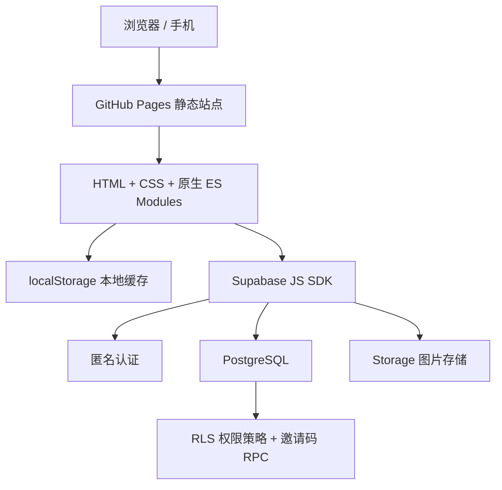

# 日常：家庭任务管理

一个面向家庭成员的日常任务与日历应用。支持成员头像、邀请码共享家庭、任务完成记录，以及完成备注和图片。

线上地址：[https://antty.github.io/daily-task/](https://antty.github.io/daily-task/)

## 技术架构



- 前端：原生 HTML、CSS、JavaScript ES Modules，无构建步骤与前端框架依赖。
- 核心模块：`src/app.js` 负责界面与交互；`src/task-domain.js` 负责任务发生日期和日历计算；`src/supabase-store.js` 负责缓存和云端同步。
- 数据与图片：Supabase PostgreSQL 保存家庭、成员、任务类型、任务和完成记录；`task-media` Storage 桶保存头像与完成图片。
- 身份与共享：Supabase Anonymous Auth 为每台设备建立身份；邀请码通过 `join_household_by_invite` RPC 加入已有家庭。
- 权限：Supabase RLS 限制为仅能读取、修改已授权家庭的数据。
- 发布：提交到 GitHub `main` 分支后，由 GitHub Pages 发布静态网站。

## 本地运行

```bash
python3 -m http.server 4173
```

访问 `http://localhost:4173`。请使用 HTTP 服务，不要直接通过 `file://` 打开。

## Supabase 配置

1. 在 **Authentication → Providers** 启用 **Anonymous Sign-Ins**。
2. 新项目在 SQL Editor 执行 [schema.sql](supabase/schema.sql)。
3. 已使用过旧版表结构的项目，再执行 [invite-migration.sql](supabase/invite-migration.sql)。
4. 仅可在 `src/supabase-config.js` 中使用 Project URL 与 Publishable key；不要提交 `service_role` 密钥。

## 测试

```bash
node --test
```
